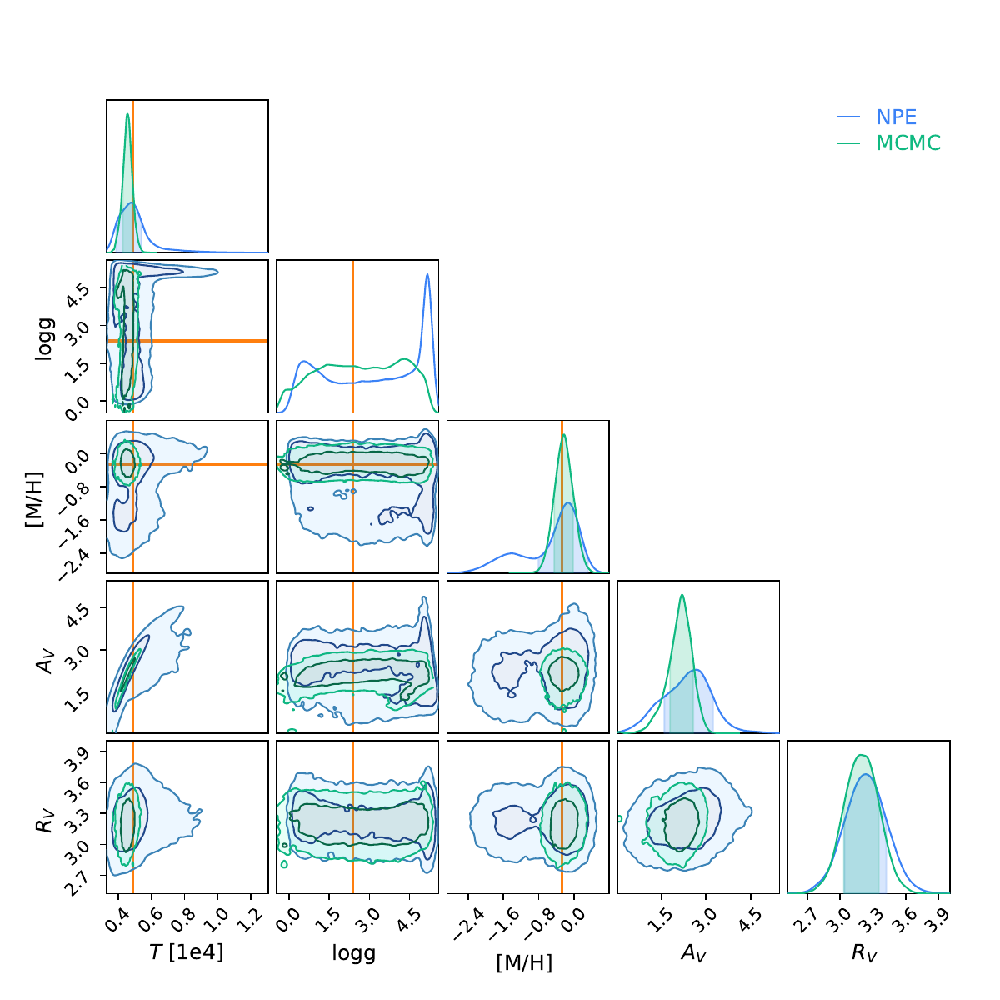

## Iris-ML - Neurak Posterior Estimation for Spectral Energy Distribution fitting

This repository contains code acompanying the [IrisML paper](https://arxiv.org/abs/2510.26964).
Presented method allows for fast and accurate estimation of stellar parameters based on the observed
photometric data allone, much faster and as accurate as MCMC! 
To reproduce the results in the paper:

1. Install [pystellibs](https://github.com/Wesenheit/pystellibs). This version contains more libraries including BOSZ. Weights for the
library are available upon personal request. One can also train the model including weights supplied with original pystellibs library like BaSeL.
2. Generate training data with `generate_data.py`.
3. Pretrain the model with `train.py`.
4. Train final SDE with `train_NDE.py`.
5. Use the model! Utilities used to validate the results and produce the plots are in files `download_data.py` and `evaluate_model.py`.

Weights used to produce the paper are available upon request. 
